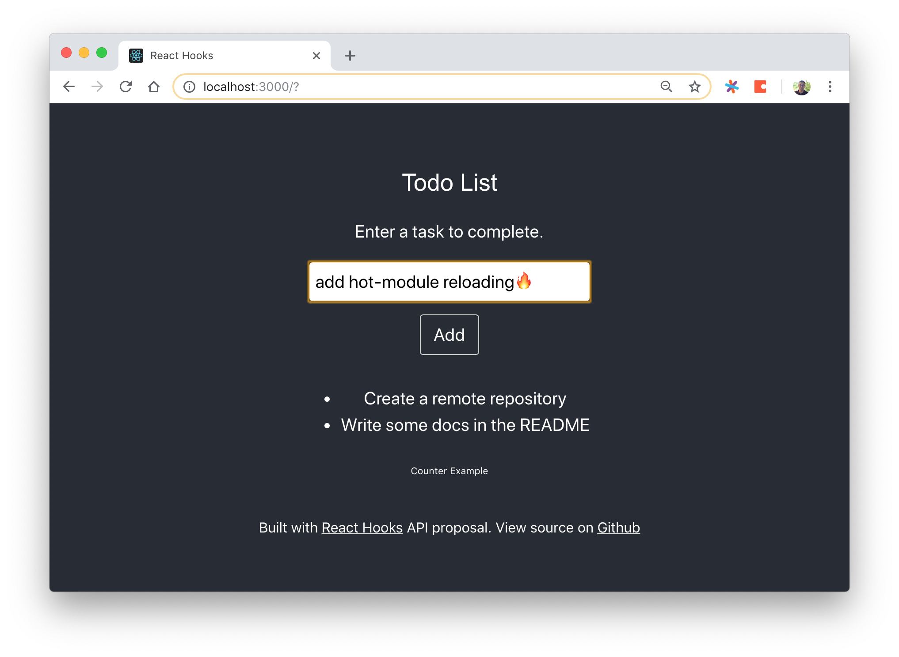
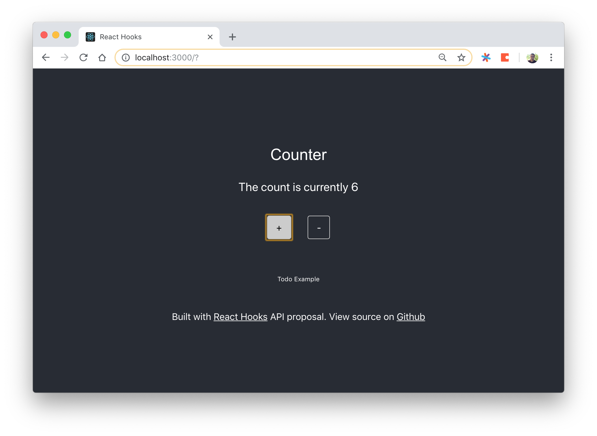

# React Hooks Demo App

A Todo and Counter Application using only functional React Components and the new React Hooks API method `useState'.

## Features

- Uses stateful methods **without any React Class Components**
  - changing the displayed app with the push of a button
  - changing state with an HTML input form
  - appending strings to an array (Todo App)
  - incrementing a counter (Counter App)
- Bootstrapped with [`create-react-app`](https://github.com/facebook/create-react-app)
- Uses `react@16.7.0@alpha` and `react-dom@16.7.0@alpha`
- Hot Module Reloading for easy development
- Slick styles with [W3CSS](https://www.w3schools.com/w3css)




## Usage

In the project directory, you can run:

### `npm install && npm start`

## Build It Yourself

```bash
npx create-react-app react-hooks
cd react-hooks
```

Install cutting-edge libraries

```bash
npm install --save react@16.7.0-alpha.0 react-dom@16.7.0-alpha.0
npm install
npm run start
```

Create a new component `Counter.js` in `src/` and add the following funcitonal class

```javascript
import React, { useState } from "react";

export default function Counter() {
  // Declare a new state variable, which we'll call "count"
  const [count, setCount] = useState(0);

  return (
    <div>
      <h2>Counter</h2>
      <p>The count is currently {count}</p>
      <button onClick={() => setCount(count + 1)}>+</button>

      <button onClick={() => setCount(count - 1)}>-</button>
    </div>
  );
}
```

Then import it into your application by adding `<Counter />` inside `App.js` along with the corresponding import statement `import Counter from "./Counter"`

### There you have it, all the benefits of state in React without all the clutter-code or oversized class components.

Finally, you can add Hot-Reloading to your app by following [this article](https://medium.com/@ryardley/react-hooks-not-magic-just-arrays-cd4f1857236e) and some slick styles by using a CSS library like [Bootstrap](getbootstrap.com), [AntDesign](ant.design) or [W3CSS](https://www.w3schools.com/w3css)
